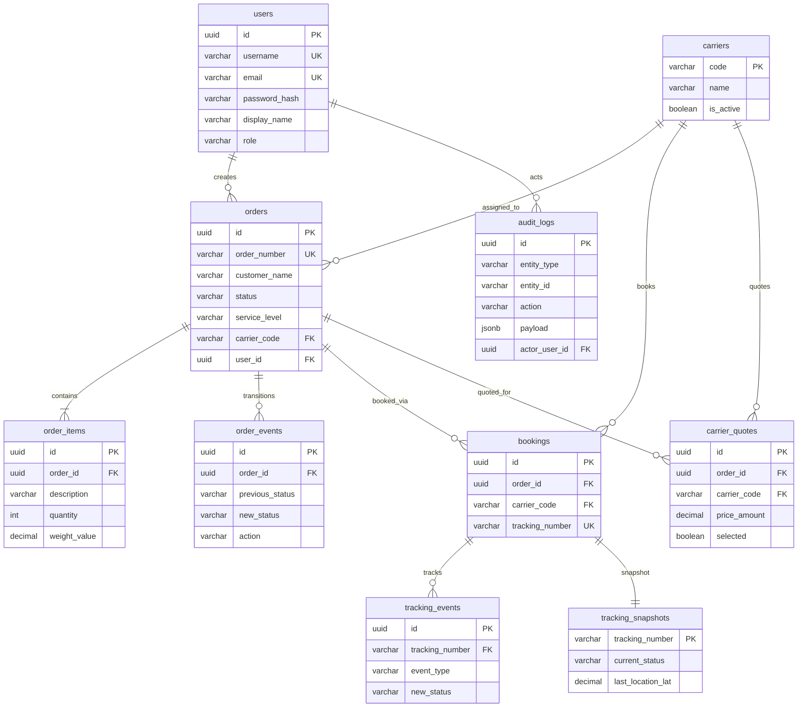

<p align="center">
  <h1 align="center">🚚 DT-Express TMS Backend</h1>
  <p align="center">
    <em>A production‑ready Transportation Management System showcasing Domain‑Driven Design, CQRS, and advanced .NET patterns — built on a realistic Chinese logistics domain.</em>
  </p>
</p>

<p align="center">
  <a href="#"></a>
  <a href="#testing-strategy"></a>
  <a href="#"></a>
  <a href="#technology-stack"></a>
  <a href="#database-design"></a>
  <a href="#getting-started"></a>
  <a href="LICENSE"></a>
</p>

---

## 📑 Table of Contents

- [Overview](#overview)
- [Technology Stack](#technology-stack)
- [System Architecture](#system-architecture)
- [Domain‑Driven Design in Action](#domain-driven-design-in-action)
- [Design Patterns Showcase](#design-patterns-showcase)
- [API Design & Documentation](#api-design--documentation)
- [Database Design](#database-design)
- [Security](#security)
- [Testing Strategy](#testing-strategy)
- [Getting Started](#getting-started)
- [Project Structure](#project-structure)
- [Future Roadmap](#future-roadmap)
- [License](#license)
- [Acknowledgments](#acknowledgments)

---

## Overview

### What is DT‑Express?

DT‑Express is a **fully‑featured TMS backend** for parcel delivery across China — covering carrier quoting, route optimization, real‑time shipment tracking, and complete order lifecycle management. It integrates with two simulated carrier APIs (SF Express 顺丰 and JD Logistics 京东), supports Chinese addresses and weight units (Kg, G, 斤, Lb), and exposes 30 RESTful endpoints plus a SignalR real‑time hub.

### Motivation

This project was **not** another blog or todo API. It was built to demonstrate how **DDD, CQRS, SOLID, and eight GoF design patterns** solve real problems in a complex logistics domain — the kind of system that ships millions of packages for companies like SF Express and JD.com. Every pattern is applied to a **genuine business requirement**, not a textbook exercise.

### Key Highlights

- **5 bounded contexts** — Orders, Routing, Carriers, Tracking, Audit — each with clear domain boundaries
- **8 design patterns** — Strategy, Factory, Adapter, Observer, State, Decorator, CQRS, Interceptor
- **Complete order state machine** — `Created → Confirmed → Shipped → Delivered / Cancelled` with no `switch`/`if‑else` chains
- **JWT authentication** — BCrypt password hashing, role‑based access control (4 roles), single‑use refresh tokens
- **PostgreSQL** with 10 normalized tables, value object flattening, JSONB audit payloads, and strategic indexing
- **85+ integration tests** via `WebApplicationFactory` — full lifecycle, RBAC, edge cases, database relationships
- **30 API endpoints** + SignalR hub — Swagger-documented with XML comments and JWT bearer integration
- **Zero switch statements** for pattern dispatch — dictionary‑based registries populated via DI (`IEnumerable<T>` injection)
- **Chinese data support** — UTF‑8 throughout: addresses (上海, 广州), names (张三), provinces, phone validation

---

## Technology Stack

| Layer | Technology | Purpose |
|-------|-----------|---------|
| **Runtime** | .NET 8 LTS (C# 12) | Long‑term support, latest language features |
| **Web Framework** | ASP.NET Core 8 (Controllers) | Enterprise‑grade API, DI‑native, action filters |
| **Database** | PostgreSQL 15 | Relational persistence, JSONB, CHECK constraints |
| **ORM** | Entity Framework Core 8 | Fluent API configuration, value object mapping |
| **Auth** | JWT Bearer + BCrypt.Net‑Next | Access/refresh tokens, password hashing (work factor 12) |
| **Real‑time** | SignalR | WebSocket‑based tracking updates |
| **API Docs** | Swashbuckle (Swagger/OpenAPI) | Interactive documentation with JWT auth button |
| **Containers** | Docker Compose | One‑command PostgreSQL setup |
| **Testing** | xUnit + WebApplicationFactory | In‑process integration testing, no external server |
| **Serialization** | System.Text.Json | High‑performance, built‑in |

---

## System Architecture

DT‑Express follows **Clean Architecture** with strict dependency rules enforced via project references. The domain layer has **zero dependencies** — pure C# only.

```
┌─────────────────────────────────────────────────────────────────────┐
│                          API Layer                                  │
│   Controllers · Middleware · Filters · DTOs · ApiResponse<T>        │
│   JWT Auth · Swagger · SignalR Hub · Correlation ID                 │
└────────────────────────────────┬────────────────────────────────────┘
                                 │  depends on
                                 ▼
┌─────────────────────────────────────────────────────────────────────┐
│                     Infrastructure Layer                            │
│   EF Core Repositories · Carrier Adapters · Routing Algorithms      │
│   State Implementations · Decorators · Factories · DI Composition   │
└────────────────────────────────┬────────────────────────────────────┘
                                 │  depends on
                                 ▼
┌─────────────────────────────────────────────────────────────────────┐
│                      Application Layer                              │
│   CQRS Commands/Queries · Handlers · Port Interfaces · App Services │
│   Cross‑domain orchestration · DTOs                                 │
└────────────────────────────────┬────────────────────────────────────┘
                                 │  depends on
                                 ▼
┌─────────────────────────────────────────────────────────────────────┐
│                        Domain Layer                                 │
│   Aggregates · Value Objects · Domain Events · Interfaces · Enums   │
│   ZERO DEPENDENCIES — pure C# only                                  │
└─────────────────────────────────────────────────────────────────────┘
```

### Layer Responsibilities

| Layer | Project | Responsibility |
|-------|---------|---------------|
| **Domain** | `DtExpress.Domain` | Rich domain models, aggregate roots, value objects (Address, Money, Weight, Dimension), domain events, interfaces for ports, enums. **No project or NuGet references.** |
| **Application** | `DtExpress.Application` | CQRS command/query contracts and handlers, application services for routing and carrier orchestration, port interfaces (`IRoutingPort`, `ICarrierPort`, `IAuditPort`). References **Domain only**. |
| **Infrastructure** | `DtExpress.Infrastructure` | Pattern implementations: state classes, strategy classes, adapter classes, decorator classes, factory classes, in‑memory stores, DI composition root. References Application + Domain. |
| **Infrastructure.Data** | `DtExpress.Infrastructure.Data` | EF Core `DbContext`, entity mappings, PostgreSQL repositories (`EfOrderRepository`, `EfAuditStore`), database seeder. References Application + Domain. |
| **API** | `DtExpress.Api` | ASP.NET Core controllers, `ApiResponse<T>` envelope, `GlobalExceptionFilter`, `CorrelationIdMiddleware`, JWT configuration, SignalR hub, Swagger setup. |

---

## Domain‑Driven Design in Action

### Bounded Contexts

The system is decomposed into **5 bounded contexts**, each with its own models, interfaces, and business rules:

| Context | Domain Problem | Key Patterns |
|---------|---------------|-------------|
| **Orders** | Full order lifecycle with state transitions, validation, and domain events | State, CQRS |
| **Routing** | Route optimization with multiple algorithms (A*, Dijkstra) and strategies | Strategy, Factory, Decorator |
| **Carriers** | Multi-carrier integration for quoting, booking, and tracking | Adapter, Factory, Decorator |
| **Tracking** | Real-time shipment status updates pushed to subscribers | Observer |
| **Audit** | Immutable event log with PII masking and correlation tracing | Interceptor, Decorator |

### Aggregates

`Order` is the central **aggregate root** — a mutable class that encapsulates state, enforces invariants, and collects domain events:

```csharp
public sealed class Order
{
    public IOrderState CurrentState { get; private set; }
    public OrderStatus Status => CurrentState.Status;

    public void Apply(OrderAction action, DateTimeOffset timestamp)
    {
        var previousStatus = Status;
        CurrentState = CurrentState.Transition(action, this);
        _domainEvents.Add(new OrderDomainEvent(Id, previousStatus, Status, action, timestamp));
    }
}
```

The `Apply()` method delegates to the **State Pattern** — no conditionals in the aggregate, just polymorphic dispatch.

### Value Objects

Seven immutable, self‑validating value objects enforce business rules at the type level:

| Value Object | Validation | Example |
|-------------|-----------|---------|
| `Address` | Chinese provinces, 6‑digit postal code, ISO country | `上海, 浦东新区, 200120` |
| `Money` | Non‑negative, supported currencies (CNY, USD), 2‑decimal rounding | `¥128.50 CNY` |
| `Weight` | Positive value, unit conversion (Kg ↔ G ↔ 斤 ↔ Lb) | `5 Jin → 2.5 Kg` |
| `Dimension` | Positive length/width/height, all‑or‑nothing constraint | `60×40×30 cm` |
| `ContactInfo` | Chinese phone regex `1[3-9]XXXXXXXXX`, optional email | `张三, 13812345678` |
| `TrackingNumber` | Non‑empty, validated format | `SF1234567890` |
| `GeoCoordinate` | Lat/Lng range validation, `DistanceTo()` calculation | `31.2304°N, 121.4737°E` |

### Domain Events

Every order state transition emits an `OrderDomainEvent` — captured and persisted to the `order_events` table. This provides a complete audit trail of state changes and enables future event‑sourcing:

```
Created ──Confirm──▶ Confirmed ──Ship──▶ Shipped ──Deliver──▶ Delivered
   │                               │                                        
   └──Cancel──▶Cancelled ◀─Cancel─┘                            
```

### State Pattern

Order states (`Created`, `Confirmed`, `Shipped`, `Delivered`, `Cancelled`) are implemented as **separate classes** implementing `IOrderState` — eliminating all `switch`/`if‑else` chains:

```csharp
public sealed class CreatedState : IOrderState
{
    public OrderStatus Status => OrderStatus.Created;

    public IOrderState Transition(OrderAction action, Order context) => action switch
    {
        OrderAction.Confirm => new ConfirmedState(),
        OrderAction.Cancel  => new CancelledState(),
        _ => throw new InvalidStateTransitionException(Status.ToString(), action.ToString()),
    };
}
```

Each state class knows **only its valid transitions** — adding a new state requires zero changes to existing code.

---

## Design Patterns Showcase

### Pattern × Domain Matrix

| Pattern | Routing | Carriers | Tracking | Orders | Audit |
|---------|:-------:|:--------:|:--------:|:------:|:-----:|
| **Strategy** | ✅ | ✅ | — | — | — |
| **Factory** | ✅ | ✅ | — | — | — |
| **Adapter** | — | ✅ | — | — | — |
| **Observer** | — | — | ✅ | — | — |
| **State** | — | — | — | ✅ | — |
| **Decorator** | ✅ | ✅ | — | — | ✅ |
| **CQRS** | — | — | — | ✅ | — |
| **Interceptor** | — | — | — | — | ✅ |

### Strategy + Factory (Routing)

Three routing strategies (`Fastest`, `Cheapest`, `Balanced`) are registered in DI and resolved by name via a **dictionary‑based factory** — fully **OCP‑compliant**:

```csharp
// Adding a new strategy = ONE new class + ONE line of DI registration
services.AddSingleton<IRouteStrategy>(sp =>
    new FastestRouteStrategy(sp.GetRequiredService<AStarPathfinder>(), ...));

// Factory builds a name→strategy dictionary from IEnumerable<IRouteStrategy>
public RouteStrategyFactory(IEnumerable<IRouteStrategy> strategies)
{
    _strategies = strategies.ToDictionary(s => s.Name, s => s, StringComparer.OrdinalIgnoreCase);
}
```

**Why it matters**: Adding a fourth strategy (e.g., `EcoFriendly`) requires exactly one new class and one DI line — zero changes to the factory, controllers, or application services.

### Adapter Pattern (Carriers)

Each carrier (SF Express, JD Logistics) has its own adapter implementing `ICarrierAdapter`. The `CarrierAdapterFactory` uses the same `IEnumerable<T>` injection pattern to build a code→adapter dictionary:

```csharp
// SF Express adapter — encapsulates SF‑specific API format, mock responses, etc.
public sealed class SfExpressAdapter : ICarrierAdapter
{
    public string CarrierCode => "SF";
    // GetQuoteAsync, BookAsync, TrackAsync — each in SF's format
}
```

**Why it matters**: Integrating a third carrier (e.g., ZTO 中通) requires one adapter class and one DI line — existing adapters are untouched.

### Observer Pattern (Tracking)

`ITrackingSubject` manages subscriptions; `ITrackingObserver` instances receive push notifications. A `SignalRTrackingObserver` bridges tracking events to WebSocket clients:

```
TrackingSubject ──publishes──▶ SignalRTrackingObserver ──pushes──▶ WebSocket clients
                              ConsoleTrackingObserver ──logs──▶ Console
```

### Decorator Pattern

Cross‑cutting concerns are layered onto core logic **without modifying it**:

| Decorator | Wraps | Purpose |
|-----------|-------|---------|
| `CachingRouteDecorator` | `IRouteStrategy` | Memoizes route calculations in `ConcurrentDictionary` |
| `LoggingRouteDecorator` | `IRouteStrategy` | Logs strategy execution time and parameters |
| `ValidationRouteDecorator` | `IRouteStrategy` | Validates request before delegating |
| `CachingCarrierDecorator` | `ICarrierAdapter` | Caches carrier quotes |
| `LoggingCarrierDecorator` | `ICarrierAdapter` | Logs carrier API calls |
| `PiiMaskingAuditDecorator` | `IAuditSink` | Masks phone (`138****5678`), email, and addresses before storage |

### CQRS (Orders)

Commands and queries are **separate types** with dedicated handlers, dispatched via a reflection‑based `CommandDispatcher` / `QueryDispatcher`:

| Type | Example | Handler |
|------|---------|---------|
| Command | `CreateOrderCommand` → `Guid` | `CreateOrderHandler` — validates, creates aggregate, persists, publishes events |
| Command | `ShipOrderCommand` → `BookingResult` | `ShipOrderHandler` — calculates route, books carrier, transitions state |
| Query | `GetOrderByIdQuery` → `OrderDetail?` | `GetOrderByIdHandler` — reads from `IOrderReadService` |
| Query | `ListOrdersQuery` → `List<OrderSummary>` | `ListOrdersHandler` — applies filters, returns projections |

### Correlation ID Middleware

Every request is tagged with a correlation ID (from `X-Correlation-ID` header or auto‑generated). This ID flows through all layers — controllers, services, audit records — enabling end‑to‑end request tracing:

```
Client ──X-Correlation-ID──▶ Middleware ──AsyncLocal──▶ Services ──▶ Audit Records
                              └──Response Header──▶ Client
```

---

## API Design & Documentation

### RESTful Principles

- **Resource‑based URLs** — `/api/orders`, `/api/carriers`, `/api/routing/calculate`
- **Proper HTTP methods** — `POST` for creation, `PUT` for state transitions, `GET` for queries
- **Meaningful status codes** — `201 Created`, `400 Bad Request`, `401 Unauthorized`, `403 Forbidden`, `404 Not Found`
- **Consistent envelope** — every response uses `ApiResponse<T>` with `success`, `data`, `error`, and `correlationId`

### Unified Response Envelope

```json
{
  "success": true,
  "data": { ... },
  "error": null,
  "correlationId": "abc-123"
}
```

### Global Exception Handling

`GlobalExceptionFilter` maps domain exceptions to HTTP responses — controllers stay clean:

| Exception | HTTP Status | Error Code |
|-----------|------------|------------|
| `InvalidStateTransitionException` | 400 | `INVALID_TRANSITION` |
| `CarrierNotFoundException` | 404 | `CARRIER_NOT_FOUND` |
| `StrategyNotFoundException` | 400 | `STRATEGY_NOT_FOUND` |
| `DomainException { Code: "NOT_FOUND" }` | 404 | `NOT_FOUND` |
| Unhandled | 500 | `INTERNAL_ERROR` |

### Endpoint Summary (30 Endpoints)

| Domain | Endpoints | Examples |
|--------|-----------|---------|
| **Auth** | 3 | Login, Register, Refresh Token |
| **Orders** | 7 | Create, List, Get, Confirm, Ship, Deliver, Cancel |
| **Advanced Orders** | 3 | Bulk Create, Update Destination, Split Shipment |
| **Routing** | 3 | Calculate Route, Compare Strategies, List Strategies |
| **Carriers** | 4 | List Carriers, Get Quotes, Book Shipment, Track |
| **Tracking** | 2 | Get Snapshot, Subscribe |
| **Audit** | 2 | Query by Entity, Query by Correlation ID |
| **Dashboard** | 3 | Stats, Carrier Performance, Top Customers |
| **Reports** | 2 | Monthly Shipments (JSON/CSV), Revenue by Carrier |
| **Webhooks** | 1 | Carrier webhook with HMAC‑SHA256 validation |

### Documentation Assets

- **Swagger UI** — Interactive API docs at `/swagger` with JWT bearer button and XML comments
- **Postman Collection** — 30 pre‑configured requests with auth scripts and environment variables
- **API Reference** — Comprehensive markdown doc in `/docs/api-reference.md`

---

## Database Design

### 10‑Table Normalized Schema



### Design Decisions

| Decision | Implementation | Why |
|----------|---------------|-----|
| **Value object flattening** | `Address` → `origin_street`, `origin_city`, etc. | EF Core owned types, queryable columns, no JSON parsing overhead |
| **Enums as strings** | `VARCHAR + CHECK` constraints | Human‑readable in queries, matches C# `.ToString()`, safe at DB level |
| **JSONB for audit** | `audit_logs.payload` column | Flexible before/after snapshots without rigid schema |
| **Business‑key index** | `UNIQUE INDEX` on `order_number` | Fast lookup by human‑readable ID (`DT-YYYYMMDD-NNN`) |
| **Composite indexes** | `(tracking_number, occurred_at)` on events | Optimized for timeline queries |
| **Cascade deletes** | `order_items`, `order_events` → `orders` | Aggregate consistency — items die with their order |
| **SET NULL on delete** | `orders.carrier_code` → `carriers` | Orders survive carrier deactivation |
| **Dual actor reference** | `actor_user_id` FK + `actor_name` string | Audit survives user deletion; name is snapshot, not live lookup |
| **All-or-nothing dimensions** | `CHECK` constraint on `dim_*` columns | Partial dimension data is meaningless |

### Seed Data

| Table | Records | Description |
|-------|---------|-------------|
| `users` | 4 | admin (系统管理员), dispatcher (调度员小李), driver (司机王师傅), viewer (客服张小姐) |
| `carriers` | 2 | SF Express (顺丰速运), JD Logistics (京东物流) |

---

## Security

### Authentication

| Feature | Implementation |
|---------|---------------|
| **Token type** | JWT Bearer (HS256) |
| **Access token** | 15‑minute expiry, contains `sub`, `role`, `displayName` claims |
| **Refresh token** | 7‑day expiry, **single‑use** (consumed after exchange) |
| **Password hashing** | BCrypt.Net‑Next, work factor 12 |
| **SignalR auth** | JWT via query string (`?access_token=...`) for WebSocket upgrade |

### Role‑Based Access Control

| Role | Create Order | Confirm/Ship | Deliver | Cancel | View | Audit | Dashboard |
|------|:-----------:|:------------:|:-------:|:------:|:----:|:-----:|:---------:|
| **Admin** | ✅ | ✅ | ✅ | ✅ | ✅ | ✅ | ✅ |
| **Dispatcher** | ✅ | ✅ | ❌ | ✅ | ✅ | ✅ | Partial |
| **Driver** | ❌ | ❌ | ✅ | ❌ | ✅ | ❌ | ❌ |
| **Viewer** | ❌ | ❌ | ❌ | ❌ | ✅ | ❌ | ❌ |

### Additional Security Measures

- **Correlation ID tracing** — Every request tagged for audit trail and distributed tracing
- **PII masking** — Phone numbers, emails, and addresses masked in audit records before storage
- **Webhook HMAC validation** — Carrier webhooks validated with `HMAC-SHA256` signature
- **Global exception filter** — Internal errors return generic messages; no stack traces leaked to clients
- **Non‑repudiation** — Every audit record links to `actor_user_id` with display name snapshot

---

## Testing Strategy

### Test Suite Overview

| Metric | Value |
|--------|-------|
| **Total tests** | 85+ |
| **Framework** | xUnit |
| **Integration testing** | `WebApplicationFactory<Program>` — full pipeline in‑process |
| **Test projects** | 4 (Domain, Application, Infrastructure, API) |
| **Test files** | 12 (8 test classes + 3 fixtures + scaffolds) |

### Coverage by Concern

| Test Class | Tests | What It Covers |
|------------|:-----:|---------------|
| `AuthenticationTests` | 14 | JWT login, registration, token refresh, correlation ID flow |
| `RoleBasedAccessControlTests` | 41 | RBAC for all 30 endpoints across 4 roles (401/403 matrix) |
| `EdgeCaseTests` | 13 | Validation errors, invalid transitions, duplicate data, not found |
| `DatabaseRelationshipTests` | 8 | FK cascades, audit trail persistence, direct `DbContext` verification |
| `OrderLifecycleTests` | 5 | Complete flow: Create → Confirm → Ship → Deliver |

### Testing Patterns

- **Arrange‑Act‑Assert (AAA)** — Every test follows a clear three‑phase structure
- **Builder pattern** — `TestDataBuilders` provides factory methods for consistent test data
- **Dual verification** — API response assertions + direct `DbContext` queries for persistence correctness
- **Role‑aware helpers** — `TestAuthHelper` authenticates as specific roles before hitting protected endpoints
- **Structured error assertions** — Tests validate `ApiResponse<T>` envelopes including `success`, error `code`, and `correlationId`

### Test Isolation

Each test run uses its own **EF Core in‑memory database** via `CustomWebApplicationFactory` — tests are fully independent with zero shared state.

---

## Getting Started

### Prerequisites

- [.NET 8 SDK](https://dotnet.microsoft.com/download/dotnet/8.0) (v8.0.417+)
- [Docker Desktop](https://www.docker.com/products/docker-desktop/) (for PostgreSQL)

### Quick Start

```bash
# 1. Clone the repository
git clone https://github.com/your-username/DT-Express.git
cd DT-Express

# 2. Start PostgreSQL (schema + seed data auto‑applied)
docker-compose up -d

# 3. Run the API
dotnet run --project src/DtExpress.Api

# 4. Open Swagger UI
# Navigate to http://localhost:5198/swagger
```

### Test Credentials

| Username | Password | Role | Display Name |
|----------|----------|------|-------------|
| `admin` | `admin123` | Admin | 系统管理员 |
| `dispatcher` | `passwd123` | Dispatcher | 调度员小李 |
| `driver` | `passwd123` | Driver | 司机王师傅 |
| `viewer` | `passwd123` | Viewer | 客服张小姐 |

### Run Tests

```bash
dotnet test
```

### Use Postman

Import the collection from the repository root:

```
DtExpress-TMS.postman_collection.json
```

The collection includes auto‑login scripts that save the JWT token to `{{accessToken}}` — all authenticated requests use it automatically.

### Docker‑Only Database

```bash
# Start PostgreSQL
docker-compose up -d

# Connect directly
psql -h localhost -p 5432 -U dtexpress -d dtexpress
# Password: dtexpress

# Stop (data persists)
docker-compose down

# Stop + delete data
docker-compose down -v
```

---

## Project Structure

```
DtExpress.sln
│
├── src/
│   ├── DtExpress.Domain/                # 🏛️ Pure domain — ZERO dependencies
│   │   ├── Orders/                      #   Order aggregate, state interface, events
│   │   ├── Routing/                     #   Route strategy, pathfinder, graph model
│   │   ├── Carrier/                     #   Carrier adapter, quote, booking contracts
│   │   ├── Tracking/                    #   Observer/subject interfaces, events
│   │   ├── Audit/                       #   Audit sink, interceptor, records
│   │   ├── ValueObjects/                #   Address, Money, Weight, Dimension, etc.
│   │   └── Common/                      #   IClock, IIdGenerator, DomainException
│   │
│   ├── DtExpress.Application/           # ⚙️ Orchestration — refs Domain only
│   │   ├── Orders/Commands/             #   CreateOrder, ConfirmOrder, ShipOrder, etc.
│   │   ├── Orders/Queries/              #   GetOrderById, ListOrders
│   │   ├── Orders/Handlers/             #   CQRS command & query handlers
│   │   ├── Routing/                     #   RouteCalculationService, RouteComparisonService
│   │   ├── Carrier/                     #   CarrierQuotingService, CarrierBookingService
│   │   ├── Ports/                       #   IRoutingPort, ICarrierPort, IAuditPort
│   │   └── Common/                      #   ICommand, IQuery, ICommandHandler, dispatchers
│   │
│   ├── DtExpress.Infrastructure/        # 🔧 Implementations — refs Application + Domain
│   │   ├── Routing/Strategies/          #   Fastest, Cheapest, Balanced strategies
│   │   ├── Routing/Algorithms/          #   A* pathfinder, Dijkstra pathfinder
│   │   ├── Routing/Decorators/          #   Caching, Logging, Validation decorators
│   │   ├── Carrier/Adapters/            #   SfExpressAdapter, JdLogisticsAdapter
│   │   ├── Carrier/Selectors/           #   CheapestCarrierSelector, FastestCarrierSelector
│   │   ├── Orders/States/               #   Created, Confirmed, Shipped, Delivered, Cancelled
│   │   ├── Tracking/                    #   InMemoryTrackingSubject, observers, sources
│   │   ├── Audit/Decorators/            #   PiiMaskingAuditDecorator
│   │   ├── Audit/Interceptors/          #   DomainEventAuditInterceptor
│   │   └── DependencyInjection/         #   Composition root — all 5 domains wired here
│   │
│   ├── DtExpress.Infrastructure.Data/   # 💾 Persistence — EF Core + PostgreSQL
│   │   ├── AppDbContext.cs              #   DbContext with Fluent API configuration
│   │   ├── Entities/                    #   10 EF entity classes (value object mapping)
│   │   ├── Repositories/               #   EfOrderRepository, EfAuditStore, etc.
│   │   └── Auth/                        #   AuthService, JwtTokenService, RefreshTokenStore
│   │
│   └── DtExpress.Api/                   # 🌐 HTTP surface — refs Infrastructure
│       ├── Controllers/                 #   9 controllers (Auth, Orders, Routing, etc.)
│       ├── Middleware/                   #   CorrelationIdMiddleware
│       ├── Filters/                     #   GlobalExceptionFilter
│       ├── Models/                      #   ApiResponse<T>, domain‑specific DTOs
│       ├── Hubs/                        #   TrackingHub (SignalR)
│       └── Program.cs                   #   DI, middleware pipeline, Swagger, JWT
│
├── tests/
│   ├── DtExpress.Domain.Tests/          # Domain unit tests
│   ├── DtExpress.Application.Tests/     # Handler unit tests
│   ├── DtExpress.Infrastructure.Tests/  # Infrastructure unit tests
│   └── DtExpress.Api.Tests/             # 85+ integration tests (WebApplicationFactory)
│       ├── Fixtures/                    #   CustomWebApplicationFactory, TestAuthHelper
│       ├── AuthenticationTests.cs       #   JWT, registration, refresh tokens
│       ├── RoleBasedAccessControlTests.cs  # 41 RBAC tests across all endpoints
│       ├── EdgeCaseTests.cs             #   Validation, error paths, boundaries
│       ├── DatabaseRelationshipTests.cs #   FK cascades, audit persistence
│       └── OrderLifecycleTests.cs       #   Full state machine lifecycle
│
├── database/
│   ├── schema.sql                       # 10‑table schema with CHECK constraints
│   └── seed-data.sql                    # Users (4) + Carriers (2)
│
├── docs/                                # Architecture docs, API reference, data models
├── docker-compose.yml                   # PostgreSQL 15 + auto schema/seed
└── DtExpress-TMS.postman_collection.json  # 30 requests with auth scripts
```

---

## Future Roadmap

If this project were to continue, the following phases would come next:

| Phase | Feature | Description |
|-------|---------|-------------|
| 🖥️ **Frontend** | React / Blazor dashboard | Order management UI, real‑time tracking map, carrier analytics |
| 🔌 **Real Carrier APIs** | SF Express, JD Logistics SDKs | Replace mock adapters with actual carrier API integrations |
| 📊 **Analytics** | Time‑series data | Delivery time trends, carrier SLA compliance, cost optimization |
| ☸️ **Kubernetes** | Container orchestration | Helm charts, health probes, horizontal scaling |
| 📨 **Event Bus** | RabbitMQ / Kafka | Replace in‑process domain events with async messaging |
| 🔄 **CI/CD** | GitHub Actions | Automated build, test, Docker image push, deployment |

---

## License

This project is licensed under the **Apache License 2.0** — see the [LICENSE](LICENSE) file for details.

---

## Acknowledgments

### Libraries & Frameworks

- [ASP.NET Core 8](https://learn.microsoft.com/en-us/aspnet/core/) — Web API framework
- [Entity Framework Core 8](https://learn.microsoft.com/en-us/ef/core/) — ORM with Fluent API
- [Npgsql](https://www.npgsql.org/) — PostgreSQL provider for EF Core
- [BCrypt.Net‑Next](https://github.com/BcryptNet/bcrypt.net) — Password hashing
- [Swashbuckle](https://github.com/domaindrivendev/Swashbuckle.AspNetCore) — Swagger / OpenAPI
- [xUnit](https://xunit.net/) — Testing framework
- [SignalR](https://learn.microsoft.com/en-us/aspnet/core/signalr/) — Real‑time WebSocket communication

### Inspiration

- [Clean Architecture](https://blog.cleancoder.com/uncle-bob/2012/08/13/the-clean-architecture.html) — Robert C. Martin
- [Domain‑Driven Design](https://www.domainlanguage.com/ddd/) — Eric Evans
- [eShopOnContainers](https://github.com/dotnet-architecture/eShopOnContainers) — Microsoft reference architecture
- Chinese logistics systems — SF Express (顺丰), JD Logistics (京东), ZTO Express (中通)

---

<p align="center">
  <sub>Built with ❤️ as a showcase of modern .NET backend architecture</sub>
</p>
